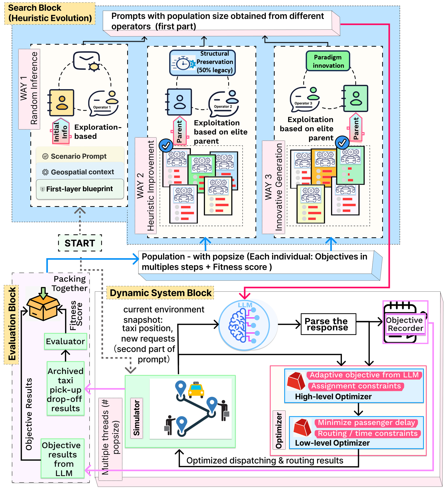

<div align="center">
<h1>Hierarchical Optimization via LLM-Guided Objective Evolution for Mobility-on-Demand Systems</h1>
<p><strong>LLM + Mathematical Optimization</strong></p>
</div>

[Paper Link](https://arxiv.org/pdf/2510.10644)

## What This Repo Is

This repository studies how to combine large language models with mathematical optimization for mobility-on-demand systems.

It currently contains two parallel tracks:

- The original MoD pipeline for hierarchical optimization.
- The Edge-UAV adaptation, where task offloading, resource allocation, and UAV trajectory planning are optimized jointly.

> Status note (2026-03-27): current project-level status is maintained in `CLAUDE.md`.
> Historical plans and diagnostic reports under `plans/` and `文档/40_审查与诊断/`
> may describe earlier pre-integration stages. For the latest Phase⑥ Step4 progress,
> see `CLAUDE.md` and `文档/70_工作日记/2026-03-27.md`.

If you only need the shortest possible mental model:

1. The LLM proposes or evolves high-level objective logic.
2. Harmony Search mutates and selects prompts/objectives.
3. The optimizer enforces hard constraints and produces feasible operational decisions.

## Progressive Disclosure

This README is organized from shallow to deep. Stop at the first level that answers your question.

### Level 0: 5-Minute Overview

Read this section if you only want to know whether this repository is relevant.

- Problem: dynamic mobility optimization under demand-supply imbalance.
- Core idea: use an LLM where objective design is hard, but keep feasibility under a mathematical optimizer.
- Main method: a three-layer architecture combining prompt evolution, optimization, and simulation feedback.
- Paper: [arXiv PDF](https://arxiv.org/pdf/2510.10644)

### Level 1: 10-Minute Getting Started

Read this section if you want to install dependencies and run something.

#### Prerequisites

- Python 3.10
- Gurobi and a valid `gurobipy` license
- An LLM API endpoint if you want to run the LLM-guided pipeline

#### Environment Setup

Recommended:

```bash
uv sync
```

Or use the original conda setup:

```bash
conda env create -f dependencies.yml
conda activate llm-guided-mod-optimization
```

#### Configure LLM Access

Edit `config/env/.env`:

```env
HUGGINGFACE_ENDPOINT="https://your-endpoint/v1"
HUGGINGFACEHUB_API_TOKEN="sk-your-api-key"
```

Edit `config/setting.cfg`:

```ini
[llmSettings]
platform = HuggingFace
model = glm-5
```

Notes:

- The current factory path is `HuggingFace`, but it is used as an OpenAI-compatible chat-completions route.
- If you switch providers or response formats, you may need to adjust request/response handling in `llmAPI/`.

#### Common Commands

```bash
uv run python testAll.py
uv run python testEdgeUav.py
uv run pytest tests -v
uv run python check_llm_api.py
```

- `uv run python testAll.py`: original MoD pipeline.
- `uv run python testEdgeUav.py`: Edge-UAV pipeline.
- `uv run pytest tests -v`: unit and integration tests.
- `uv run python check_llm_api.py`: quick validation of LLM connectivity.

### Level 2: Architecture and Code Navigation

Read this section if you want to modify code, debug behavior, or add new modules.

#### Three-Layer Architecture

1. `LLM as Meta-Objective Designer`
2. `Harmony Search as Prompt Evolver`
3. `Optimizer as Constraint Enforcer`

#### Main Entry Points

- `testAll.py`: original project entry.
- `testEdgeUav.py`: Edge-UAV entry.
- `check_llm_api.py`: API connectivity check.
- `analyze_results.py`: result inspection and summary.

#### High-Level Directory Map

- `llmAPI/`: LLM interface and provider-specific request/response logic.
- `prompt/`: prompt templates and prompt evolution logic for the original pipeline.
- `heuristics/`: Harmony Search framework and population evolution.
- `model/`: original optimization models.
- `edge_uav/`: Edge-UAV data model, prompts, scenario generation, and optimization blocks.
- `simulator/`: simulation and evaluation logic for the original pipeline.
- `tests/`: unit and integration tests.
- `文档/`: design notes, formula derivations, implementation plans, audits, and paper materials.

### Level 3: Where To Read Next

Read this section if you need targeted documentation instead of reading code directly.

#### If you are new to the project

- [文档导航_渐进式披露版](./文档/00_总览/文档导航_渐进式披露版.md)
- [仿真参数说明_Simulation_Setup](./文档/00_总览/仿真参数说明_Simulation_Setup.md)
- [project_structure_analysis](./文档/00_总览/project_structure_analysis.md)

#### If you want the mathematical model

- [公式与两层解耦整合版_最新版_2026-03-24](./文档/10_模型与公式/公式与两层解耦整合版_最新版_2026-03-24.md)
- [公式20_两层解耦](./文档/10_模型与公式/公式20_两层解耦.md)
- [底层变量清单](./文档/10_模型与公式/底层变量清单.md)
- [图片变量映射分析](./文档/10_模型与公式/图片变量映射分析.md)

#### If you want implementation plans

- [场景生成器设计方案](./文档/20_架构与实现/场景生成器设计方案.md)
- [precompute_analysis](./文档/20_架构与实现/precompute_analysis.md)
- [Phase6_Step2_resource_alloc详细实施计划](./文档/20_架构与实现/Phase6_Step2_resource_alloc详细实施计划.md)
- [Phase6_BCD循环实施计划](./文档/20_架构与实现/Phase6_BCD循环实施计划.md)

#### If you want tests and diagnostics

- [S7_e2e_test_plan](./文档/30_测试与执行/S7_e2e_test_plan.md)
- [首次试跑计划_Phase5_pipeline](./文档/30_测试与执行/首次试跑计划_Phase5_pipeline.md)
- [Phase5_LLM调用问题诊断报告](./文档/40_审查与诊断/Phase5_LLM调用问题诊断报告.md)
- [代码清理审查报告_2026-03-23](./文档/40_审查与诊断/代码清理审查报告_2026-03-23.md)

#### If you are writing the paper

- [项目文档_MoD原始参考](./文档/50_论文材料/项目文档_MoD原始参考.md)
- [chapter1/1_绪论](./文档/50_论文材料/chapter1/1_绪论.md)
- [chapter3/3.1_系统架构](./文档/50_论文材料/chapter3/3.1_系统架构.md)
- [chapter3/3.2_信道与通信模型](./文档/50_论文材料/chapter3/3.2_信道与通信模型.md)
- [chapter3/3.3_任务卸载与边缘计算模型](./文档/50_论文材料/chapter3/3.3_任务卸载与边缘计算模型.md)
- [chapter3/3.4_无人机轨迹与能耗模型](./文档/50_论文材料/chapter3/3.4_无人机轨迹与能耗模型.md)
- [chapter3/3.5_联合优化问题建模](./文档/50_论文材料/chapter3/3.5_联合优化问题建模.md)

## Method Overview

<p align="center">
  
</p>

<p align="center">
  
</p>

The method combines semantic search over objectives with rigorous operational optimization:

- `LLM`: proposes strategic objective logic.
- `Harmony Search`: explores the prompt/objective space.
- `Optimizer + Simulator`: checks feasibility and measures actual performance.

This design keeps the creative part soft and the constraint part hard.

## Edge-UAV Adaptation

The Edge-UAV branch targets computational task offloading from mobile devices to UAV-mounted edge servers.

Its main decision blocks are:

- Offloading decisions.
- CPU frequency and resource allocation.
- UAV trajectory planning.

The intended decomposition is:

1. Fix trajectory/resources and solve offloading.
2. Fix offloading and optimize Level 2.
3. Split Level 2 into resource allocation and trajectory optimization.

Relevant code is mainly under `edge_uav/`, `heuristics/`, `config/`, and `tests/`.

## Practical Notes

- `Gurobi` is required for the binary optimization parts.
- `config/env/.env` is not tracked by git and must be created locally.
- Some LLM providers may require adapter changes in `llmAPI/`.
- Results are typically written under `discussion/`.

## License

This project is licensed under the MIT License. See `LICENSE` for details.

Some dependencies, especially Gurobi, require separate licenses.

## Citation

If you use this code in research, please cite:

```bibtex
@inproceedings{llm-guided-mod-optimization,
  title={Hierarchical Optimization via LLM-Guided Objective Evolution for Mobility-on-Demand Systems},
  author={Yi Zhang, Yushen Long, Yun Ni, Liping Huang, Xiaohong Wang, Jun Liu},
  booktitle={Conference on Neural Information Processing Systems (NeurIPS)},
  year={2025}
}
```
