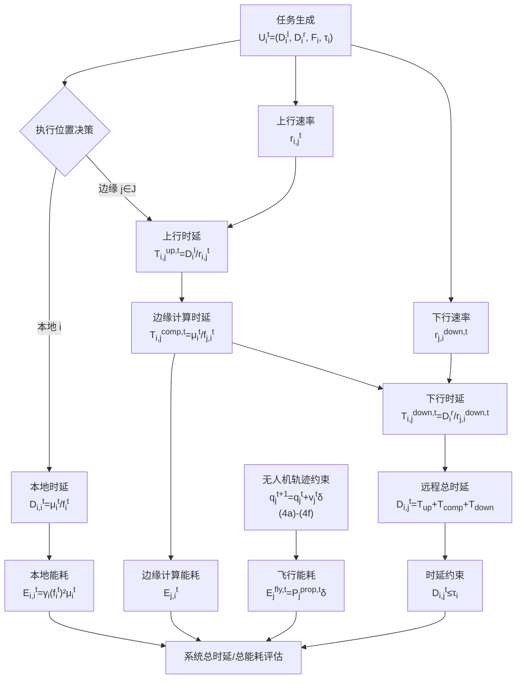

# 公式整理（统一上下标版）

## 0. 符号统一说明（重要）

本文件中的公式来源于不同论文，原始记号存在冲突。为便于实现与复现，本文仅做**符号标准化**，不改变物理/优化含义。

统一规则如下：

- 时间索引统一为离散时隙 $t$（不再混用 $t_0\Delta$）。
- 下标优先表示实体索引（设备/节点/任务等），如 $r_{i,j}^t$、$E_{j,i}^t$。
- 上标中若包含多种信息，统一写成“语义标签在前、时间在后”，如 $E_j^{\mathrm{fly},t}$、$P_j^{\mathrm{prop},t}$。
- 纯时间上标保持 $^t$、$^{t+1}$ 等形式，如 $U_i^t$、$\mathbf{q}_j^{t+1}$。
- 集合统一为：
  - 终端设备集合：$\mathcal{I}$；
  - 无人机集合：$\mathcal{U}$；
  - 每时隙任务集合：$\mathcal{S}^t=\{U_i^t\mid i\in\mathcal{I}\}$；
  - 边缘节点集合：$\mathcal{J}=\{b\}\cup\mathcal{U}$。
- 原文中可能出现的任务符号 $\mathcal{K}_i^t$，本文统一记为 $U_i^t$。
- 决策时隙集合定义为：$\mathcal{T}=\{1,2,\dots,T\}$。
- $T$ 表示规划时域内的最后一个时隙索引（终止时隙）。
- $\delta$ 表示单个时隙长度（单位：s）。
- $\mathbf{v}_j^t$ 表示无人机 $j$ 在时隙 $t$ 的速度向量；$v_j^t$ 表示其模长，满足 $v_j^t=\|\mathbf{v}_j^t\|$。

### 上下标含义对照

- 下标 $i,j,j'$：实体索引。常见地，$i$ 表示终端设备（TD），$j,j'$ 表示边缘节点/UAV。
- 下标中的重复实体（如 $D_{i,i}^t, E_{i,i}^t$）：表示“设备 $i$ 对自身任务的本地执行”。
- 上标 $t,t+1,T$：时间索引（时隙编号）。
- 上标中的语义标签（如 $\mathrm{fly}, \mathrm{prop}, \mathrm{safe}, \max, I, F$）：物理意义标签，不是时间。
- 混合上标（如 $E_j^{\mathrm{fly},t}$）：前者为语义标签，后者为时间索引。
- 向量/矩阵统一加粗（如 $\mathbf{q}_j^t,\mathbf{v}_j^t$），标量保持普通体（如 $v_j^t,f_i^t$）。

---

## 1. 双向任务模型

在每个时隙内，终端设备（TD）$i\in\mathcal{I}$ 生成双向计算任务：

$$
U_i^t \triangleq (D_i^l, D_i^r, F_i, \tau_i), \quad i \in \mathcal{I},\ t\in\mathcal{T}
$$

任务集合定义为：

$$
\mathcal{S}^t = \{U_i^t \mid i \in \mathcal{I}\},\quad t\in\mathcal{T}
$$

其中：

- $D_i^l$：本地输入数据量（bits）；
- $D_i^r$：远程输入数据量（bits）；
- $F_i$：所需 CPU 周期数（cycles）；
- $\mu_i^t$：时隙 $t$ 内分配给任务 $U_i^t$ 的计算量，满足 $\sum_{t\in\mathcal{T}}\mu_i^t=F_i$（若任务单时隙完成，可取 $\mu_i^t=F_i$）；
- $\tau_i$：最大允许时延（s）。

---

## 2. 通信模型

采用 OFDMA，设备 $i\in\mathcal{I}$ 到边缘节点 $j\in\mathcal{J}$ 的上行速率为：

$$
r_{i,j}^t = B_{i,j} \log_2\!\left(1+\frac{P_i^t g_{i,j}^t}{N_0}\right)
\tag{5}
$$

下行（边缘节点 $j$ 到设备 $i$）速率定义为：

$$
r_{j,i}^{\mathrm{down},t} = B_{j,i}^{\mathrm{down}} \log_2\!\left(1+\frac{P_j^t g_{j,i}^t}{N_0}\right)
\tag{6}
$$

其中：

- $r_{i,j}^t$：时隙 $t$ 内设备 $i$ 到边缘节点 $j$ 的上行传输速率；
- $r_{j,i}^{\mathrm{down},t}$：时隙 $t$ 内边缘节点 $j$ 到设备 $i$ 的下行传输速率；
- $B_{i,j}$、$B_{j,i}^{\mathrm{down}}$：上行/下行链路带宽；
- $P_i^t$、$P_j^t$：设备 $i$ 与边缘节点 $j$ 在时隙 $t$ 的发射功率；
- $g_{i,j}^t$、$g_{j,i}^t$：上行/下行链路信道增益；
- $N_0$：噪声功率。

---

## 3. 本地执行时延与能耗

当任务 $U_i^t$ 由设备 $i$ 本地执行：

$$
D_{i,i}^t = \frac{\mu_i^t}{f_i^t}
\tag{12}
$$

$$
E_{i,i}^t = \gamma_i (f_i^t)^2 \mu_i^t
\tag{13}
$$

其中：

- $D_{i,i}^t$：任务 $U_i^t$ 在设备 $i$ 本地执行的时延；
- $E_{i,i}^t$：任务 $U_i^t$ 在设备 $i$ 本地执行的能耗；
- $f_i^t$：设备 $i$ 在时隙 $t$ 可用于本地计算的 CPU 频率；
- $\mu_i^t$：时隙 $t$ 内分配给任务 $U_i^t$ 的计算量（CPU 周期数）；
- $\gamma_i$：设备 $i$ 的芯片能耗系数。

---

## 4. 远程卸载时延模型

当任务 $U_i^t$ 卸载到边缘节点 $j\in\mathcal{J}$ 执行时，总时延由上行传输、边缘计算和下行回传三部分构成：

$$
D_{i,j}^t = T_{i,j}^{\mathrm{up},t} + T_{i,j}^{\mathrm{comp},t} + T_{i,j}^{\mathrm{down},t}
\tag{14}
$$

各子项定义为：

$$
T_{i,j}^{\mathrm{up},t} = \frac{D_i^l}{r_{i,j}^t}
\tag{15a}
$$

$$
T_{i,j}^{\mathrm{comp},t} = \frac{\mu_i^t}{f_{j,i}^t}
\tag{15b}
$$

$$
T_{i,j}^{\mathrm{down},t} = \frac{D_i^r}{r_{j,i}^{\mathrm{down},t}}
\tag{15c}
$$

远程卸载任务需满足时延约束：

$$
D_{i,j}^t \le \tau_i, \quad \forall i\in\mathcal{I},\ j\in\mathcal{J},\ t\in\mathcal{T}
\tag{16}
$$

其中：

- $D_{i,j}^t$：任务 $U_i^t$ 在时隙 $t$ 卸载到边缘节点 $j$ 的总完成时延；
- $T_{i,j}^{\mathrm{up},t}$：上行传输时延；
- $T_{i,j}^{\mathrm{comp},t}$：边缘侧计算执行时延；
- $T_{i,j}^{\mathrm{down},t}$：下行回传时延；
- $f_{j,i}^t$：边缘节点 $j$ 在时隙 $t$ 分配给任务 $U_i^t$ 的 CPU 频率；
- $\tau_i$：任务 $U_i^t$ 的时延上限；
- $\mathcal{I},\mathcal{J},\mathcal{T}$：分别为设备集合、边缘节点集合、时隙集合。

---

## 5. 无人机移动模型

无人机 $j\in\mathcal{U}$ 固定高度 $H$ 飞行，水平位置：

$$
\mathbf{q}_j^t = [x_j^t, y_j^t]^T
$$

位置更新：

$$
\mathbf{q}_j^{t+1} = \mathbf{q}_j^t + \mathbf{v}_j^t\,\delta, \quad \forall j\in\mathcal{U},\ t\in\mathcal{T}
\tag{3}
$$

约束条件：

$$
0 \le x_j^t \le x^{\max}, \quad \forall j\in\mathcal{U},\ t\in\mathcal{T}
\tag{4a}
$$

$$
0 \le y_j^t \le y^{\max}, \quad \forall j\in\mathcal{U},\ t\in\mathcal{T}
\tag{4b}
$$

$$
\mathbf{q}_j^1 = \mathbf{q}_j^I,\ \mathbf{q}_j^{T} = \mathbf{q}_j^F, \quad \forall j\in\mathcal{U}
\tag{4c}
$$

$$
\|\mathbf{q}_j^{t+1}-\mathbf{q}_j^t\| \le v_U^{\max}\delta, \quad \forall j\in\mathcal{U},\ t\in\mathcal{T}
\tag{4d}
$$

$$
\|\mathbf{q}_j^F-\mathbf{q}_j^t\| \le v_U^{\max}(T-t)\delta, \quad \forall j\in\mathcal{U},\ t\in\mathcal{T}
\tag{4e}
$$

$$
\|\mathbf{q}_j^t-\mathbf{q}_{j'}^t\| \ge d_U^{\mathrm{safe}}, \quad \forall j\neq j',\ j,j'\in\mathcal{U},\ t\in\mathcal{T}
\tag{4f}
$$

其中：

- $H$：无人机飞行固定高度；
- $\mathbf{q}_j^t=[x_j^t,y_j^t]^T$：无人机 $j$ 在时隙 $t$ 的二维水平位置向量；
- $x_j^t,\ y_j^t$：分别为无人机 $j$ 在时隙 $t$ 的横坐标与纵坐标分量；
- $x^{\max},\ y^{\max}$：任务区域在 $x/y$ 方向的边界上限；
- $\mathbf{q}_j^I,\ \mathbf{q}_j^F$：无人机 $j$ 的初始位置与终止位置；
- $\mathbf{v}_j^t$：无人机 $j$ 在时隙 $t$ 的速度向量，且 $v_j^t=\|\mathbf{v}_j^t\|$；
- $v_U^{\max}$：无人机允许的最大飞行速度；
- $d_U^{\mathrm{safe}}$：任意两架无人机之间的最小安全间距；
- $\delta$：单个时隙长度；
- $\mathcal{T}=\{1,\dots,T\}$：时隙集合，$T$ 为规划时域的最后时隙索引。

---

## 6. 无人机推进能耗与边缘服务总能耗

无人机推进功率模型：

$$
P_j^{\mathrm{prop},t} = \eta_1\!\left(1+\frac{3(v_j^t)^2}{(v_j^{\mathrm{tip}})^2}\right)
+ \eta_2\sqrt{\sqrt{\eta_3+\frac{(v_j^t)^4}{4}}-\frac{(v_j^t)^2}{2}}
+ \eta_4(v_j^t)^3
\tag{18}
$$

单时隙飞行能耗：

$$
E_j^{\mathrm{fly},t} = P_j^{\mathrm{prop},t}\,\delta
\tag{17}
$$

边缘节点 $j\in\mathcal{J}$ 为任务 $U_i^t$ 的服务总能耗：

$$
E_{j,i}^t=
\begin{cases}
\gamma_j(f_{j,i}^t)^2\mu_i^t, & j=b \\
\gamma_j(f_{j,i}^t)^2\mu_i^t + P_j^{\mathrm{prop},t}\delta, & j\in\mathcal{U}
\end{cases}
\tag{19}
$$

其中：

- $P_j^{\mathrm{prop},t}$：无人机 $j$ 在时隙 $t$ 的推进功率；
- $E_j^{\mathrm{fly},t}$：无人机 $j$ 在时隙 $t$ 的飞行能耗；
- $\eta_1,\eta_2,\eta_3,\eta_4$：推进功率模型参数；
- $v_j^t$：无人机 $j$ 在时隙 $t$ 的速度模长；
- $v_j^{\mathrm{tip}}$：旋翼桨尖速度（推进模型参数）；
- $E_{j,i}^t$：边缘节点 $j$ 为任务 $U_i^t$ 提供服务的总能耗；
- $\gamma_j$：边缘节点 $j$ 的芯片能耗系数；
- $f_{j,i}^t$：边缘节点 $j$ 分配给任务 $U_i^t$ 的 CPU 频率；
- $b$：地面基站节点（即 $\mathcal{J}$ 中的非 UAV 节点）。

---

## 7. 系统成本模型（目标优化函数）

由于延迟和能耗在单位量级上的差异，系统成本被建模为基于所有任务归一化延迟与归一化能耗之和，其表达式为：

$$
C^t = \sum_{i\in\mathcal{I}}\sum_{j\in\mathcal{J}} \zeta_i^t x_{i,j}^t \frac{D_{i,j}^t}{\tau_i} 
+ \sum_{i\in\mathcal{I}}\sum_{j\in\mathcal{J}} \zeta_i^t x_{i,j}^t \frac{E_{i,j}^t}{E_i^{\max}} 
+ \sum_{i\in\mathcal{I}}\sum_{j\in\mathcal{J}} \zeta_i^t x_{i,j}^t \frac{E_{j,i}^t}{E_j^{\max}}, \quad (22)
$$

其中：
- $C^t$：时隙 $t$ 内系统的总归一化综合成本；
- $\zeta_i^t \in \{0,1\}$：指示变量，表示终端设备 $i$ 在时隙 $t$ 是否有新任务生成；
- $x_{i,j}^t \in \{0,1\}$：决策变量，表示任务由设备 $i$ 执行还是卸载到节点 $j$ 执行（注意：原图使用 $o_{i,n}^t$，本文统一采用 $x_{i,j}^t$，当 $j=i$ 时表示本地执行）；
- $E_i^{\max}, E_j^{\max}$：分别为移动设备 $i$ 与边缘计算服务器（或无人机）$j$ 的能耗约束上限；
- $\tau_i$：作为时延的归一化分母（即任务的最大容忍时延）。

---

## 8. 公式串联流程图

