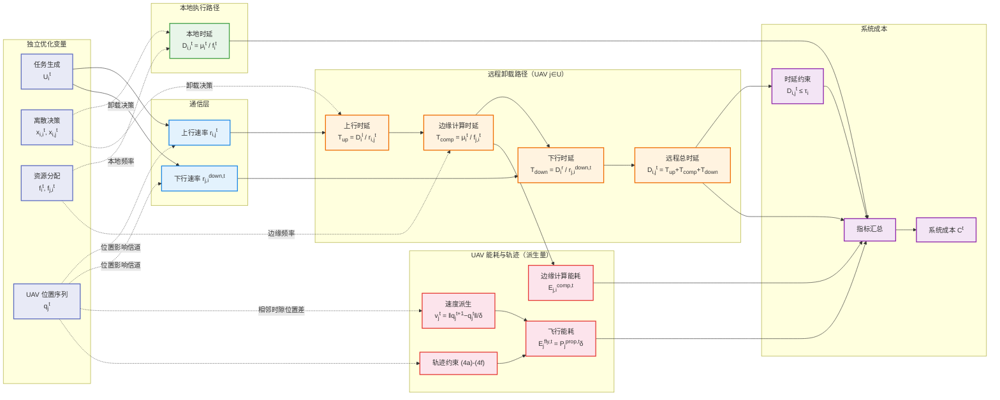

# 公式整理（统一上下标版）

## 0. 符号统一说明（重要）

本文件中的公式来源于不同论文，原始记号存在冲突。为便于实现与复现，本文仅做**符号标准化**，不改变物理/优化含义。

统一规则如下：

- 时间索引统一为离散时隙 $t$（不再混用 $t_0\Delta$）。
- 下标优先表示实体索引（设备/节点/任务等），如 $r_{i,j}^t$、$E_{j,i}^t$。
- 上标中若包含多种信息，统一写成“语义标签在前、时间在后”，如 $E_j^{\mathrm{fly},t}$、$P_j^{\mathrm{prop},t}$。
- 纯时间上标保持 $^t$、$^{t+1}$ 等形式，如 $U_i^t$、$\mathbf{q}_j^{t+1}$。
- 集合统一为：
  - 终端设备集合：$\mathcal{I}$；
  - 无人机集合：$\mathcal{U}$；
  - 每时隙任务集合：$\mathcal{S}^t=\{U_i^t\mid i\in\mathcal{I}\}$；
  - 边缘节点集合：$\mathcal{J}=\mathcal{U}$（本文不引入地面基站，所有边缘节点均为 UAV）。
- 原文中可能出现的任务符号 $\mathcal{K}_i^t$，本文统一记为 $U_i^t$。
- 决策时隙集合定义为：$\mathcal{T}=\{1,2,\dots,T\}$。
- $T$ 表示规划时域内的最后一个时隙索引（终止时隙）。
- $\delta$ 表示单个时隙长度（单位：s）。
- $\mathbf{v}_j^t$ 表示无人机 $j$ 在时隙 $t$ 的速度向量；$v_j^t$ 表示其模长，满足 $v_j^t=\|\mathbf{v}_j^t\|$。
- **重要**：$\mathbf{v}_j^t$ 不是独立优化变量，而是由相邻时隙位置唯一确定的派生量：$\mathbf{v}_j^t = (\mathbf{q}_j^{t+1} - \mathbf{q}_j^t)/\delta$。唯一的独立轨迹优化变量为位置序列 $\{\mathbf{q}_j^t\}$。

### 上下标含义对照

- 下标 $i,j,j'$：实体索引。常见地，$i$ 表示终端设备（TD），$j,j'$ 表示边缘节点/UAV。
- 下标中的重复实体（如 $D_{i,i}^t, E_{i,i}^t$）：表示“设备 $i$ 对自身任务的本地执行”。
- 上标 $t,t+1,T$：时间索引（时隙编号）。
- 上标中的语义标签（如 $\mathrm{fly}, \mathrm{prop}, \mathrm{safe}, \max, I, F$）：物理意义标签，不是时间。
- 混合上标（如 $E_j^{\mathrm{fly},t}$）：前者为语义标签，后者为时间索引。
- 向量/矩阵统一加粗（如 $\mathbf{q}_j^t,\mathbf{v}_j^t$），标量保持普通体（如 $v_j^t,f_i^t$）。

---

## 1. 双向任务模型

在每个时隙内，终端设备（TD）$i\in\mathcal{I}$ 生成双向计算任务：

$$
U_i^t \triangleq (D_i^l, D_i^r, F_i, \tau_i), \quad i \in \mathcal{I},\ t\in\mathcal{T}
$$

任务集合定义为：

$$
\mathcal{S}^t = \{U_i^t \mid i \in \mathcal{I}\},\quad t\in\mathcal{T}
$$

其中：

- $D_i^l$：本地输入数据量（bits）；
- $D_i^r$：远程输入数据量（bits）；
- $F_i$：所需 CPU 周期数（cycles）；
- $\mu_i^t$：时隙 $t$ 内分配给任务 $U_i^t$ 的计算量，满足 $\sum_{t\in\mathcal{T}}\mu_i^t=F_i$（若任务单时隙完成，可取 $\mu_i^t=F_i$）；
- $\tau_i$：最大允许时延（s）。

---

## 2. 通信模型

采用 OFDMA，设备 $i\in\mathcal{I}$ 到边缘节点 $j\in\mathcal{J}$ 的上行速率为：

$$
r_{i,j}^t = B_{i,j} \log_2\!\left(1+\frac{P_i g_{i,j}^t}{N_0}\right)
\tag{5}
$$

下行（边缘节点 $j$ 到设备 $i$）速率定义为：

$$
r_{j,i}^{\mathrm{down},t} = B_{j,i}^{\mathrm{down}} \log_2\!\left(1+\frac{P_j^t g_{j,i}^t}{N_0}\right)
\tag{6}
$$

其中：

- $r_{i,j}^t$：时隙 $t$ 内设备 $i$ 到边缘节点 $j$ 的上行传输速率；
- $r_{j,i}^{\mathrm{down},t}$：时隙 $t$ 内边缘节点 $j$ 到设备 $i$ 的下行传输速率；
- $B_{i,j}$、$B_{j,i}^{\mathrm{down}}$：上行/下行链路带宽；
- $P_i$、$P_j^t$：设备 $i$ 的上行发射功率（常数）与边缘节点 $j$ 在时隙 $t$ 的发射功率；
- $g_{i,j}^t$、$g_{j,i}^t$：上行/下行链路信道增益；
- $N_0$：噪声功率。

---

## 3. 本地执行时延

当任务 $U_i^t$ 由设备 $i$ 本地执行：

$$
D_{i,i}^t = \frac{\mu_i^t}{f_i^t}
\tag{12}
$$

其中：

- $D_{i,i}^t$：任务 $U_i^t$ 在设备 $i$ 本地执行的时延；
- $f_i^t$：设备 $i$ 在时隙 $t$ 可用于本地计算的 CPU 频率；
- $\mu_i^t$：时隙 $t$ 内分配给任务 $U_i^t$ 的计算量（CPU 周期数）。

---

## 4. 远程卸载时延模型

当任务 $U_i^t$ 卸载到边缘节点 $j\in\mathcal{J}$ 执行时，总时延由上行传输、边缘计算和下行回传三部分构成：

$$
D_{i,j}^t = T_{i,j}^{\mathrm{up},t} + T_{i,j}^{\mathrm{comp},t} + T_{i,j}^{\mathrm{down},t}
\tag{14}
$$

各子项定义为：

$$
T_{i,j}^{\mathrm{up},t} = \frac{D_i^l}{r_{i,j}^t}
\tag{15a}
$$

$$
T_{i,j}^{\mathrm{comp},t} = \frac{\mu_i^t}{f_{j,i}^t}
\tag{15b}
$$

$$
T_{i,j}^{\mathrm{down},t} = \frac{D_i^r}{r_{j,i}^{\mathrm{down},t}}
\tag{15c}
$$

远程卸载任务需满足时延约束：

$$
D_{i,j}^t \le \tau_i, \quad \forall i\in\mathcal{I},\ j\in\mathcal{J},\ t\in\mathcal{T}
\tag{16}
$$

其中：

- $D_{i,j}^t$：任务 $U_i^t$ 在时隙 $t$ 卸载到边缘节点 $j$ 的总完成时延；
- $T_{i,j}^{\mathrm{up},t}$：上行传输时延；
- $T_{i,j}^{\mathrm{comp},t}$：边缘侧计算执行时延；
- $T_{i,j}^{\mathrm{down},t}$：下行回传时延；
- $f_{j,i}^t$：边缘节点 $j$ 在时隙 $t$ 分配给任务 $U_i^t$ 的 CPU 频率；
- $\tau_i$：任务 $U_i^t$ 的时延上限；
- $\mathcal{I},\mathcal{J},\mathcal{T}$：分别为设备集合、边缘节点集合、时隙集合。

---

## 5. 无人机移动模型

无人机 $j\in\mathcal{U}$ 固定高度 $H$ 飞行，水平位置：

$$
\mathbf{q}_j^t = [x_j^t, y_j^t]^T
$$

位置更新：

$$
\mathbf{q}_j^{t+1} = \mathbf{q}_j^t + \mathbf{v}_j^t\,\delta, \quad \forall j\in\mathcal{U},\ t\in\mathcal{T}
\tag{3}
$$

由此可知，速度向量是位置的派生量，而非独立变量：

$$
\mathbf{v}_j^t = \frac{\mathbf{q}_j^{t+1} - \mathbf{q}_j^t}{\delta}, \quad v_j^t = \|\mathbf{v}_j^t\| = \frac{\|\mathbf{q}_j^{t+1} - \mathbf{q}_j^t\|}{\delta}
\tag{3'}
$$

约束条件：

$$
0 \le x_j^t \le x^{\max}, \quad \forall j\in\mathcal{U},\ t\in\mathcal{T}
\tag{4a}
$$

$$
0 \le y_j^t \le y^{\max}, \quad \forall j\in\mathcal{U},\ t\in\mathcal{T}
\tag{4b}
$$

$$
\mathbf{q}_j^1 = \mathbf{q}_j^I,\ \mathbf{q}_j^{T} = \mathbf{q}_j^F, \quad \forall j\in\mathcal{U}
\tag{4c}
$$

$$
\|\mathbf{q}_j^{t+1}-\mathbf{q}_j^t\| \le v_U^{\max}\delta, \quad \forall j\in\mathcal{U},\ t\in\mathcal{T}
\tag{4d}
$$

$$
\|\mathbf{q}_j^F-\mathbf{q}_j^t\| \le v_U^{\max}(T-t)\delta, \quad \forall j\in\mathcal{U},\ t\in\mathcal{T}
\tag{4e}
$$

$$
\|\mathbf{q}_j^t-\mathbf{q}_{j'}^t\| \ge d_U^{\mathrm{safe}}, \quad \forall j\neq j',\ j,j'\in\mathcal{U},\ t\in\mathcal{T}
\tag{4f}
$$

其中：

- $H$：无人机飞行固定高度；
- $\mathbf{q}_j^t=[x_j^t,y_j^t]^T$：无人机 $j$ 在时隙 $t$ 的二维水平位置向量；
- $x_j^t,\ y_j^t$：分别为无人机 $j$ 在时隙 $t$ 的横坐标与纵坐标分量；
- $x^{\max},\ y^{\max}$：任务区域在 $x/y$ 方向的边界上限；
- $\mathbf{q}_j^I,\ \mathbf{q}_j^F$：无人机 $j$ 的初始位置与终止位置；
- $\mathbf{v}_j^t$：无人机 $j$ 在时隙 $t$ 的速度向量（**派生量**，由 $\mathbf{q}_j^{t+1}$ 与 $\mathbf{q}_j^t$ 唯一确定，见公式 3'），且 $v_j^t=\|\mathbf{v}_j^t\|$；
- $v_U^{\max}$：无人机允许的最大飞行速度；
- $d_U^{\mathrm{safe}}$：任意两架无人机之间的最小安全间距；
- $\delta$：单个时隙长度；
- $\mathcal{T}=\{1,\dots,T\}$：时隙集合，$T$ 为规划时域的最后时隙索引。

---

## 6. 无人机推进能耗与边缘计算能耗

无人机推进功率模型（注意：$v_j^t$ 由位置序列派生，见公式 3'，因此该功率本质上是 $\mathbf{q}_j^t$ 与 $\mathbf{q}_j^{t+1}$ 的函数）：

$$
P_j^{\mathrm{prop},t} = 
\underbrace{\eta_1\!\left(1+\frac{3(v_j^t)^2}{(v_j^{\mathrm{tip}})^2}\right)}_{\text{凸（关于 } v_j^t\text{）}}
+ \underbrace{\eta_2\sqrt{\sqrt{\eta_3+\frac{(v_j^t)^4}{4}}-\frac{(v_j^t)^2}{2}}}_{\boxed{\text{凹（关于 } v_j^t\text{）— 非凸源}}}
+ \underbrace{\eta_4(v_j^t)^3}_{\text{凸（关于 } v_j^t\text{）}}
\tag{18}
$$

单时隙飞行能耗：

$$
E_j^{\mathrm{fly},t} = P_j^{\mathrm{prop},t}\,\delta
\tag{17}
$$

边缘节点 $j\in\mathcal{J}$ 为任务 $U_i^t$ 提供计算服务的能耗：

$$
E_{j,i}^{\mathrm{comp},t} = \gamma_j(f_{j,i}^t)^2\mu_i^t, \quad j\in\mathcal{J}=\mathcal{U}
\tag{19}
$$

其中：

- $P_j^{\mathrm{prop},t}$：无人机 $j$ 在时隙 $t$ 的推进功率；
- $E_j^{\mathrm{fly},t}$：无人机 $j$ 在时隙 $t$ 的飞行能耗；
- $\eta_1,\eta_2,\eta_3,\eta_4$：推进功率模型参数；
- $v_j^t$：无人机 $j$ 在时隙 $t$ 的速度模长（**派生量**，$v_j^t = \|\mathbf{q}_j^{t+1} - \mathbf{q}_j^t\|/\delta$）；
- $v_j^{\mathrm{tip}}$：旋翼桨尖速度（推进模型参数）；
- $E_{j,i}^{\mathrm{comp},t}$：边缘节点 $j$ 为任务 $U_i^t$ 提供计算服务的能耗（不含飞行能耗）；
- $\gamma_j$：边缘节点 $j$ 的芯片能耗系数；
- $f_{j,i}^t$：边缘节点 $j$ 分配给任务 $U_i^t$ 的 CPU 频率。

**依赖链总结**：公式 (20) 第 4 项中飞行能耗对位置变量 $\mathbf{q}_j^t$ 的完整传导路径为：

$$
\mathbf{q}_j^t,\,\mathbf{q}_j^{t+1}
\xrightarrow{\text{公式 (3')}} \mathbf{v}_j^t
\xrightarrow{\|\cdot\|} v_j^t
\xrightarrow{\text{公式 (18)}} P_j^{\mathrm{prop},t}
\xrightarrow{\times\,\delta\ \text{公式 (17)}} E_j^{\mathrm{fly},t}
$$

---

## 7. 系统成本模型（目标优化函数）

由于时延、边缘计算能耗与无人机飞行能耗的量纲和量级不同，系统成本建模为加权归一化和。系统成本函数写为：

$$
\begin{aligned}
C^t
&=
\underbrace{\alpha \sum_{i\in\mathcal{I}} \zeta_i^t \left(
x_{i,i}^t \frac{D_{i,i}^t}{\tau_i}
+ \sum_{j\in\mathcal{J}} x_{i,j}^t \frac{D_{i,j}^t}{\tau_i}
\right)}_{\boxed{\text{非凸（含 } \frac{1}{r_{i,j}^t} \text{，依赖 } \mathbf{q}_j^t \text{）}}} \\
&\quad
+ \underbrace{\gamma \sum_{i\in\mathcal{I}} \sum_{j\in\mathcal{J}} \zeta_i^t x_{i,j}^t
\frac{\gamma_j (f_{j,i}^t)^2 \mu_i^t}{E_j^{\max}}}_{\text{凸（关于 } f_{j,i}^t \text{ 的二次函数）}} \\
&\quad
+ \underbrace{\lambda \sum_{j\in\mathcal{U}} \frac{E_j^{\mathrm{fly},t}}{E_j^{\max}}}_{\boxed{\text{非凸（Induced power 凹，依赖 } v_j^t \text{）}}}.
\end{aligned}
\tag{20}
$$

其中：
- $C^t$：时隙 $t$ 内系统的总归一化综合成本；
- $\zeta_i^t \in \{0,1\}$：指示变量，表示终端设备 $i$ 在时隙 $t$ 是否有新任务生成；
- $x_{i,i}^t \in \{0,1\}$：本地执行决策变量，$x_{i,i}^t=1$ 表示任务 $U_i^t$ 由设备 $i$ 本地处理；
- $x_{i,j}^t \in \{0,1\},\ j\in\mathcal{J}$：远程卸载决策变量，$x_{i,j}^t=1$ 表示任务 $U_i^t$ 卸载到边缘节点 $j$ 执行；
- $E_j^{\mathrm{fly},t}$：无人机 $j$ 在时隙 $t$ 的飞行能耗；
- $E_j^{\max}$：边缘节点 $j$ 的能耗归一化基准或能耗上限；
- $\alpha,\gamma,\lambda \ge 0$：分别为时延成本、边缘计算能耗成本与无人机飞行能耗成本的权重系数；
- $\tau_i$：任务 $U_i^t$ 的最大容忍时延，用作时延归一化分母。

### 7.1 优化变量

由公式 (20) 可知，该问题同时包含二元卸载决策变量与连续资源/轨迹变量，因此本模型属于混合整数非线性规划（MINLP）问题。关于各项凸性与非凸性的严格分析，见 [文档/公式20_凸性分析.md](E:\desktop\llm-guided-mod-optimization\文档\公式20_凸性分析.md)。

#### 独立优化变量

优化变量可分为以下三类：

1. 离散决策变量（卸载决策）：
   $\{x_{i,i}^t,\ x_{i,j}^t \mid i\in\mathcal{I},\ j\in\mathcal{J},\ t\in\mathcal{T}\}$。
   其中，$x_{i,i}^t\in\{0,1\}$ 表示任务 $U_i^t$ 是否由设备 $i$ 本地执行，$x_{i,j}^t\in\{0,1\}$ 表示任务 $U_i^t$ 是否卸载到边缘节点 $j$ 执行。
   维度：本地 $|\mathcal{I}|\times|\mathcal{T}|$，远程 $|\mathcal{I}|\times|\mathcal{J}|\times|\mathcal{T}|$。

2. 连续资源分配变量：
   $\{f_i^t,\ f_{j,i}^t \mid i\in\mathcal{I},\ j\in\mathcal{J},\ t\in\mathcal{T}\}$。
   其中，$f_i^t$ 表示设备 $i$ 在时隙 $t$ 的本地 CPU 频率，$f_{j,i}^t$ 表示边缘节点 $j$ 在时隙 $t$ 分配给任务 $U_i^t$ 的 CPU 频率。
   维度：$f_i^t$ 为 $|\mathcal{I}|\times|\mathcal{T}|$，$f_{j,i}^t$ 为 $|\mathcal{J}|\times|\mathcal{I}|\times|\mathcal{T}|$。

3. UAV 轨迹变量（位置序列）：
   $\{\mathbf{q}_j^t \mid j\in\mathcal{U},\ t\in\mathcal{T}\}$。
   其中，$\mathbf{q}_j^t=[x_j^t,y_j^t]^T\in\mathbb{R}^2$ 表示无人机 $j$ 在时隙 $t$ 的二维水平位置。
   维度：$2\times|\mathcal{U}|\times|\mathcal{T}|$（按二维分量计）。

#### 派生量（非独立优化变量）

以下量由独立优化变量唯一确定，不构成额外自由度：

| 派生量 | 定义 | 所依赖的独立变量 |
|---|---|---|
| $\mathbf{v}_j^t$ | $(\mathbf{q}_j^{t+1} - \mathbf{q}_j^t)/\delta$（速度向量） | $\mathbf{q}_j^t,\,\mathbf{q}_j^{t+1}$ |
| $v_j^t$ | $\|\mathbf{v}_j^t\|$（速度模长） | $\mathbf{q}_j^t,\,\mathbf{q}_j^{t+1}$ |
| $P_j^{\mathrm{prop},t}$ | 公式 (18)（推进功率） | $\mathbf{q}_j^t,\,\mathbf{q}_j^{t+1}$ |
| $E_j^{\mathrm{fly},t}$ | $P_j^{\mathrm{prop},t}\cdot\delta$（飞行能耗） | $\mathbf{q}_j^t,\,\mathbf{q}_j^{t+1}$ |
| $r_{i,j}^t$ | 公式 (5)（上行速率） | $\mathbf{q}_j^t$（通过信道增益 $g_{i,j}^t$） |
| $r_{j,i}^{\mathrm{down},t}$ | 公式 (6)（下行速率） | $\mathbf{q}_j^t$（通过信道增益 $g_{j,i}^t$） |
| $D_{i,i}^t$ | $\mu_i^t / f_i^t$（本地时延） | $f_i^t$ |
| $D_{i,j}^t$ | 公式 (14)（远程时延） | $f_{j,i}^t,\,\mathbf{q}_j^t$ |

#### 各独立优化变量在公式 (20) 各项中的出现位置

| 公式(20)各项 | $x_{i,i}^t$ | $x_{i,j}^t$ | $f_i^t$ | $f_{j,i}^t$ | $\mathbf{q}_j^t$ |
|---|:---:|:---:|:---:|:---:|:---:|
| 第 1 项（归一化时延） | $\checkmark$ | $\checkmark$ | $\checkmark$ | $\checkmark$ | $\checkmark$（通过 $r_{i,j}^t$） |
| 第 2 项（边缘计算能耗） | | $\checkmark$ | | $\checkmark$ | |
| 第 3 项（飞行能耗） | | | | | $\checkmark$（通过 $v_j^t \to P_j^{\mathrm{prop},t}$） |

---

## 8. 公式串联流程图

